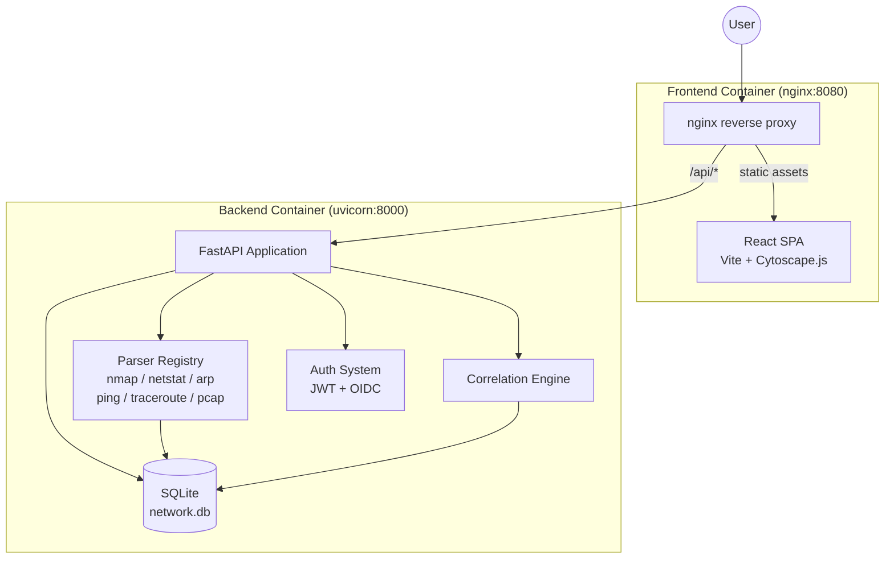
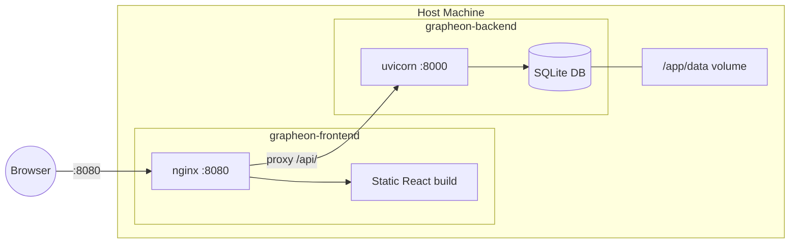
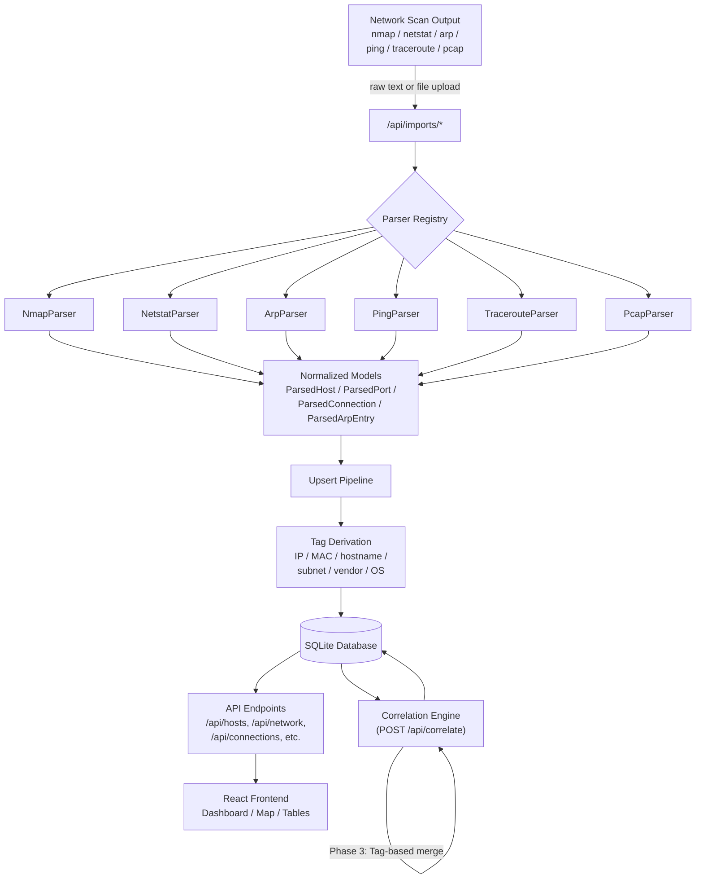
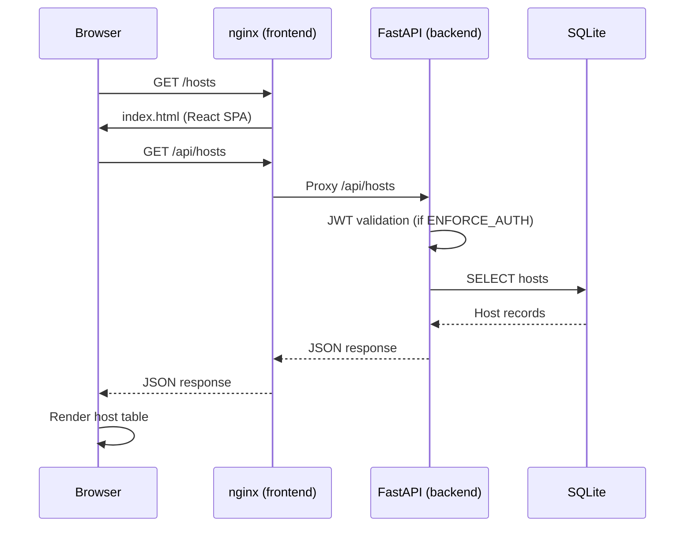

# Architecture Overview

Grapheon is a FastAPI backend with a React frontend, deployed as two Docker containers. It ingests multiple network data formats, normalizes them into a common schema, tags entities, and correlates them into a graph-like model. The repo standardizes on Python 3.12.

## System Overview

## Components

- **Backend:** FastAPI API server in `backend/` with SQLAlchemy async models and parser modules.
- **Frontend:** Vite + React SPA in `frontend/` that visualizes hosts, ports, connections, and ARP data.
- **Database:** SQLite database at `data/network.db` (ignored by git). Schema is created on startup.
- **Parsers:** Format-specific parsers in `backend/parsers/` (nmap, netstat, arp, ping, traceroute, pcap).

## Container Topology

The frontend nginx container proxies all `/api/` requests to `http://grapheon-backend:8000`. Static assets (the React SPA build) are served directly by nginx. The backend persists data to a mounted volume at `/app/data`.

## Data Flow

1. Data arrives via raw text or file upload at `/api/imports/*`.
2. The parser registry selects a parser based on `source_type` and normalizes the payload into hosts, ports, connections, ARP entries, or traceroute hops.
3. The import pipeline upserts hosts and related records, and assigns tags (IP, MAC, port, service, subnet).
4. Correlation merges related hosts using IP matching, MAC-based device identity, and tag similarity while guarding against conflicting MACs.
5. The frontend queries `/api/*` endpoints to render dashboards, tables, and the network graph.

## Request Lifecycle

## Environment Standard

- Python: 3.12.x via `nix develop` and `.python-version`.
- Node: managed by the Nix dev shell (currently Node 22).
- Docker images: Python 3.12-slim (backend), Node 20-alpine build + nginx 1.27-alpine (frontend).
