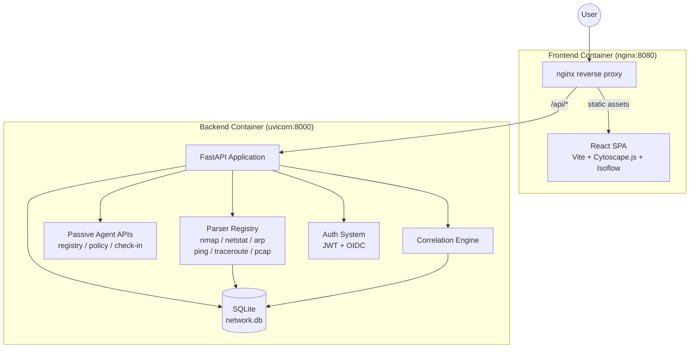
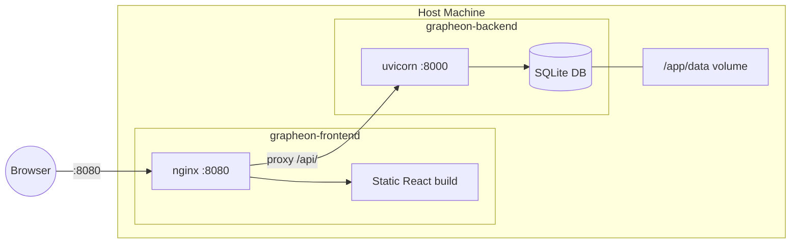
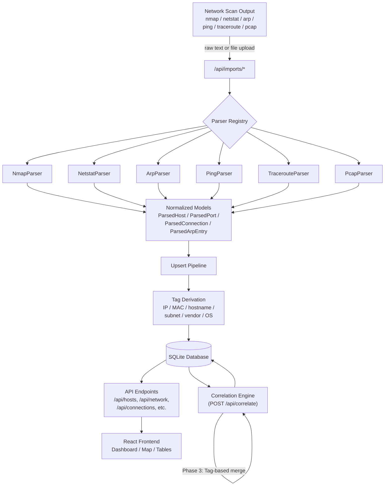
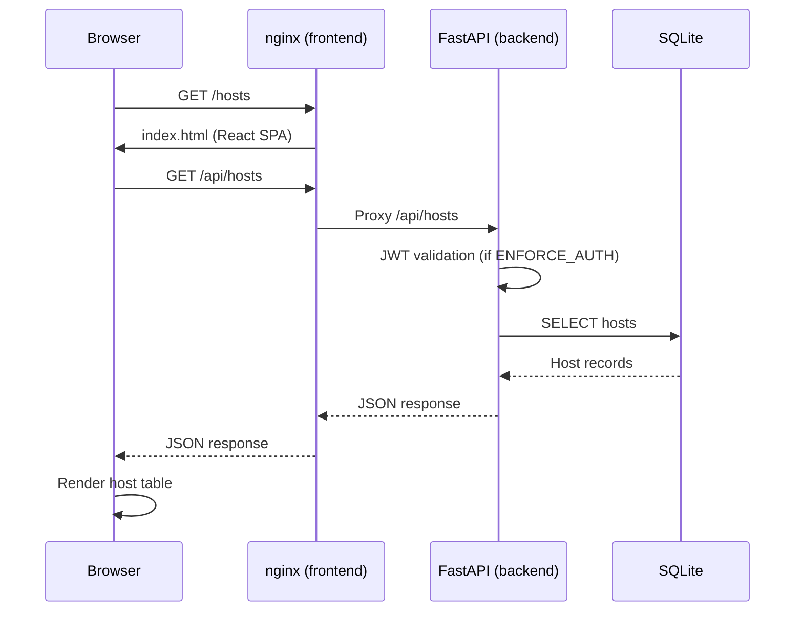

# Architecture Overview

Graphēon is a FastAPI backend with a React frontend, deployed as two Docker containers. It ingests multiple network data formats, normalizes them into a common schema, tags entities, and correlates them into a graph-like model. The repo standardizes on Python 3.12. It also now includes the backend foundations for outbound-only passive agents that report local observations back to the API.

## System Overview

```mermaid
graph TB
    subgraph "Frontend Container (nginx:8080)"
        UI[React SPA<br/>Vite + Cytoscape.js + Isoflow]
        NGINX[nginx reverse proxy]
    end

    subgraph "Backend Container (uvicorn:8000)"
        API[FastAPI Application]
        PARSERS[Parser Registry<br/>nmap / netstat / arp<br/>ping / traceroute / pcap]
        AGENTS[Passive Agent APIs<br/>registry / policy / check-in]
        CORRELATION[Correlation Engine]
        AUTH[Auth System<br/>JWT + OIDC]
        DB[(SQLite<br/>network.db)]
    end

    USER((User)) --> NGINX
    NGINX -->|/api/*| API
    NGINX -->|static assets| UI
    API --> PARSERS
    API --> AGENTS
    API --> CORRELATION
    API --> AUTH
    API --> DB
    PARSERS --> DB
    CORRELATION --> DB
```

## Components

- **Backend:** FastAPI API server in `backend/` with SQLAlchemy async models and parser modules.
- **Frontend:** Vite + React SPA in `frontend/` that visualizes hosts, ports, connections, and ARP data. Offers Cytoscape.js graph view and experimental isoflow isometric view.
- **Database:** SQLite database at `data/network.db` (ignored by git). Schema is created on startup.
- **Parsers:** Format-specific parsers in `backend/parsers/` (nmap, netstat, arp, ping, traceroute, pcap).

## Container Topology

```mermaid
graph LR
    subgraph "Host Machine"
        subgraph "grapheon-frontend"
            NGINX[nginx :8080]
            STATIC[Static React build]
        end

        subgraph "grapheon-backend"
            UVICORN[uvicorn :8000]
            SQLITE[(SQLite DB)]
        end

        VOL["/app/data volume"]
    end

    BROWSER((Browser)) -->|:8080| NGINX
    NGINX -->|proxy /api/| UVICORN
    NGINX --> STATIC
    UVICORN --> SQLITE
    SQLITE --- VOL
```

The frontend nginx container proxies all `/api/` requests to `http://grapheon-backend:8000`. Static assets (the React SPA build) are served directly by nginx. The backend persists data to a mounted volume at `/app/data`.

## Data Flow

```mermaid
flowchart TD
    A[Network Scan Output<br/>nmap / netstat / arp /<br/>ping / traceroute / pcap] -->|raw text or file upload| B["/api/imports/*"]
    B --> C{Parser Registry}
    C --> D[NmapParser]
    C --> E[NetstatParser]
    C --> F[ArpParser]
    C --> G[PingParser]
    C --> H[TracerouteParser]
    C --> I[PcapParser]
    D & E & F & G & H & I --> J[Normalized Models<br/>ParsedHost / ParsedPort /<br/>ParsedConnection / ParsedArpEntry]
    J --> K[Upsert Pipeline]
    K --> L[Tag Derivation<br/>IP / MAC / hostname /<br/>subnet / vendor / OS]
    L --> M[(SQLite Database)]
    M --> N["Correlation Engine<br/>(POST /api/correlate)"]
    N -->|Phase 1: IP merge| N
    N -->|Phase 2: MAC device identity| N
    N -->|Phase 3: Tag-based merge| N
    N --> M
    M --> O[API Endpoints<br/>/api/hosts, /api/network,<br/>/api/connections, etc.]
    O --> P[React Frontend<br/>Dashboard / Map / Tables]
```

1. Data arrives via raw text or file upload at `/api/imports/*`.
2. The parser registry selects a parser based on `source_type` and normalizes the payload into hosts, ports, connections, ARP entries, or traceroute hops.
3. The import pipeline upserts hosts and related records, and assigns tags (IP, MAC, port, service, subnet).
4. Correlation merges related hosts using IP matching, MAC-based device identity, and tag similarity while guarding against conflicting MACs.
5. The frontend queries `/api/*` endpoints to render dashboards, tables, and the network graph.

Passive agents follow a parallel path:

1. A lightweight one-shot collector runs locally on a managed host and gathers passive observations from local commands such as `ip neigh`, `ss -tunap`, `ip addr`, and `ip route`.
2. The agent registers outbound with `POST /api/agents/register` using an admin-created enrollment key plus a locally persisted random `agent_uuid`.
3. An admin can review the pending record in the UI and approve it.
4. Once approved, the agent receives a per-agent API key and uses it for `POST /api/agents/check-in`.
5. The backend stores the report in `agent_checkins` and `raw_imports`, and upserts `hosts`, `arp_entries`, and `connections`.
6. Existing correlation and graph APIs can then operate on the newly ingested passive data.

## Request Lifecycle

```mermaid
sequenceDiagram
    participant B as Browser
    participant N as nginx (frontend)
    participant F as FastAPI (backend)
    participant D as SQLite

    B->>N: GET /hosts
    N->>B: index.html (React SPA)
    B->>N: GET /api/hosts
    N->>F: Proxy /api/hosts
    F->>F: JWT validation (if ENFORCE_AUTH)
    F->>D: SELECT hosts
    D-->>F: Host records
    F-->>N: JSON response
    N-->>B: JSON response
    B->>B: Render host table
```

## Environment Standard

- Python: 3.12.x via `nix develop` and `.python-version`.
- Node: managed by the Nix dev shell (currently Node 22).
- Docker images: Python 3.12-slim (backend), Node 20-alpine build + nginx 1.27-alpine (frontend).
