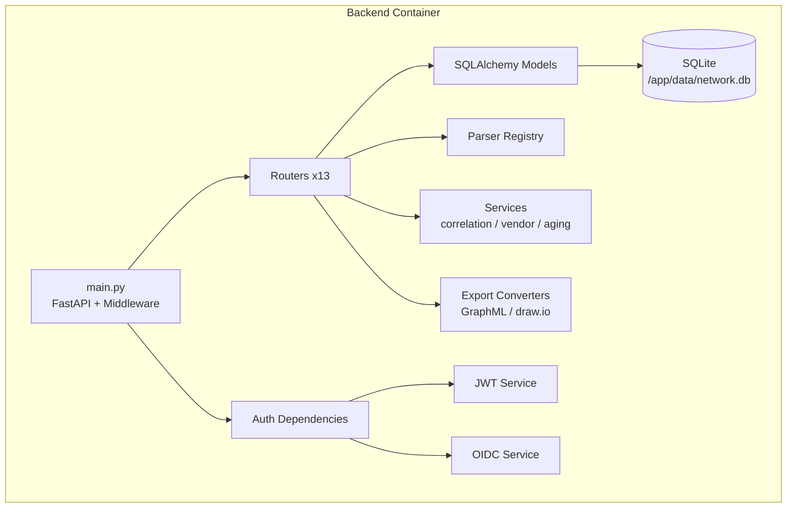

# Backend

The Graphēon backend is a FastAPI app in `backend/`, using async SQLAlchemy with SQLite. Python 3.12 is required. The backend runs as a Docker container (port 8000) alongside the frontend container.



## Run Locally

Use the Nix dev shell for any Python command.

```bash
nix develop -c bash -lc "cd backend && uvicorn main:app --reload"
```

## Configuration

- Settings live in `backend/config.py` using Pydantic settings.
- `.env` is supported for local overrides. Do not commit `.env` files.
- Default database URL is `sqlite:///./data/network.db`.
- Backend version is sourced from `backend/VERSION`.

## Container

`backend/Dockerfile` packages the FastAPI app as a `python:3.12-slim` image published to GHCR. The container exposes port 8000 and expects a writable `/app/data` for the SQLite database. See `docs/deployment.md` for the full deployment guide.

## Changelog

- Release notes live in `backend/CHANGELOG.md`.

## API Surface

Routers are registered in `backend/main.py`:

- `hosts` at `/api/hosts`
- `imports` at `/api/imports`
- `correlation` at `/api/correlate`
- `network` at `/api/network`
- `connections` at `/api/connections`
- `arp` at `/api/arp`
- `search` at `/api/search`
- `export` at `/api/export`
- `maintenance` at `/api/maintenance`
- `vlans` at `/api/vlans`
- `updates` at `/api/updates`
- `device_identities` at `/api/device-identities`
- `auth` at `/api/auth`

## Authentication

API endpoints use role-based dependencies with JWT Bearer tokens. By default (`AUTH_ENABLED=True`, `ENFORCE_AUTH=False`), unauthenticated requests are still permitted; set `ENFORCE_AUTH=True` to require JWTs for all protected routes. The system supports:

- **Multi-provider OIDC** — Okta, Google, GitHub, GitLab, Authentik, or any compliant IdP
- **Local admin fallback** — bootstrap/break-glass credentials via environment variables
- **3-tier RBAC** — admin, editor, viewer roles enforced per-endpoint

Auth is configured via environment variables (see `backend/.env.example`) and OIDC providers are stored in the database. See `docs/auth_provider.md` for the complete setup guide.

Key environment variables:

| Variable | Default | Description |
|----------|---------|-------------|
| `AUTH_ENABLED` | `True` | Master switch for authentication |
| `ENFORCE_AUTH` | `False` | When True, all endpoints require valid JWT |
| `JWT_SECRET` | `change-me-in-production` | HMAC signing key (change this!) |
| `JWT_EXPIRATION_MINUTES` | `60` | Token lifetime |
| `LOCAL_ADMIN_USERNAME` | — | Bootstrap admin username |
| `LOCAL_ADMIN_EMAIL` | — | Bootstrap admin email |
| `LOCAL_ADMIN_PASSWORD` | — | Bootstrap admin password (bcrypt hashed on startup) |

## Database

- Models live in `backend/models/`: Host, Port, Connection, ARPEntry, RouteHop, RawImport, Conflict, Vlan, DeviceIdentity, User, AuthProvider, RoleMapping.
- Tables are created on startup in `backend/database.py`.
- Lightweight migrations add new columns at startup via `_run_migrations`.

## Parsers

Parser implementations live in `backend/parsers/` and normalize source data to parser models. Supported sources include nmap, netstat, arp, ping, traceroute, and pcap.
