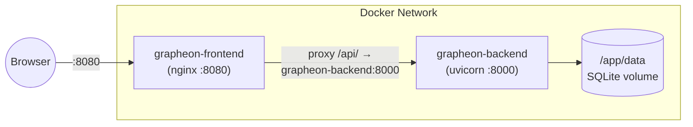
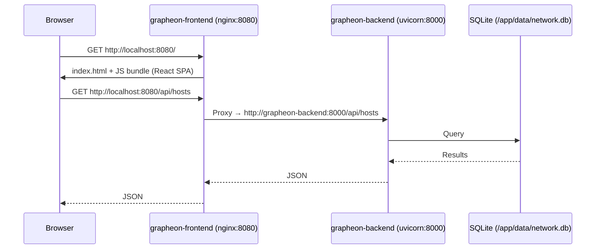
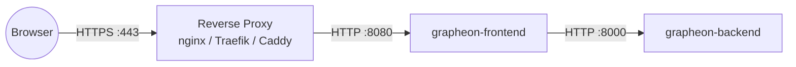

# Deployment

Grapheon deploys as two Docker containers: a **backend** (FastAPI + SQLite) and a **frontend** (React SPA served by nginx). The frontend container proxies `/api/` requests to the backend.



## Container Images

Images are published to GHCR on every merge to `master` when a new version is detected:

| Image | Port | Base |
|-------|------|------|
| `ghcr.io/badgerops/grapheon-backend` | 8000 | python:3.12-slim |
| `ghcr.io/badgerops/grapheon-frontend` | 8080 | nginx:1.27-alpine |

Tags follow `latest` and `vX.Y.Z` (e.g., `v0.8.3`).

## Quick Start with Docker

```bash
# Create a Docker network so the containers can communicate
docker network create grapheon

# Run the backend
docker run -d \
  --name grapheon-backend \
  --network grapheon \
  -p 8000:8000 \
  -v grapheon-data:/app/data \
  -e JWT_SECRET="$(openssl rand -hex 32)" \
  -e LOCAL_ADMIN_USERNAME=admin \
  -e LOCAL_ADMIN_EMAIL=admin@example.com \
  -e LOCAL_ADMIN_PASSWORD=changeme \
  ghcr.io/badgerops/grapheon-backend:latest

# Run the frontend
docker run -d \
  --name grapheon-frontend \
  --network grapheon \
  -p 8080:8080 \
  ghcr.io/badgerops/grapheon-frontend:latest
```

Access the UI at `http://localhost:8080`. The backend API is also directly available at `http://localhost:8000`.

## Docker Compose

Create a `docker-compose.yml`:

```yaml
services:
  grapheon-backend:
    image: ghcr.io/badgerops/grapheon-backend:latest
    container_name: grapheon-backend
    ports:
      - "8000:8000"
    volumes:
      - grapheon-data:/app/data
    environment:
      AUTH_ENABLED: "True"
      ENFORCE_AUTH: "True"
      JWT_SECRET: "your-production-secret-key-min-32-chars"
      JWT_EXPIRATION_MINUTES: "60"
      LOCAL_ADMIN_USERNAME: "admin"
      LOCAL_ADMIN_EMAIL: "admin@example.com"
      LOCAL_ADMIN_PASSWORD: "YourSecurePasswordHere"
    restart: unless-stopped

  grapheon-frontend:
    image: ghcr.io/badgerops/grapheon-frontend:latest
    container_name: grapheon-frontend
    ports:
      - "8080:8080"
    depends_on:
      - grapheon-backend
    restart: unless-stopped

volumes:
  grapheon-data:
    driver: local
```

```bash
docker compose up -d
```

The frontend nginx config resolves `grapheon-backend` by container name (see `frontend/nginx.conf`), so the backend service **must** be named `grapheon-backend` (or the nginx config updated to match).

## How the Containers Connect



The key networking detail: nginx proxies `/api/` to `http://grapheon-backend:8000` using Docker DNS resolution. This means both containers must be on the same Docker network and the backend container must be named `grapheon-backend`.

## Environment Variables

All configuration is via environment variables on the **backend** container:

| Variable | Default | Description |
|----------|---------|-------------|
| `DATABASE_URL` | `sqlite:///./data/network.db` | SQLAlchemy database URL |
| `AUTH_ENABLED` | `True` | Master switch for authentication |
| `ENFORCE_AUTH` | `False` | When True, all endpoints require valid JWT |
| `JWT_SECRET` | `change-me-in-production` | HMAC signing key (change this!) |
| `JWT_ALGORITHM` | `HS256` | JWT signing algorithm |
| `JWT_EXPIRATION_MINUTES` | `60` | Token lifetime |
| `LOCAL_ADMIN_USERNAME` | — | Bootstrap admin username |
| `LOCAL_ADMIN_EMAIL` | — | Bootstrap admin email |
| `LOCAL_ADMIN_PASSWORD` | — | Bootstrap admin password (bcrypt hashed on startup) |

The frontend container has no configuration. It serves the pre-built React SPA and proxies API calls.

## Volume Mounts

The backend container requires a persistent volume at `/app/data` for the SQLite database. Without this mount, data is lost when the container restarts.

```bash
# Named volume (recommended)
-v grapheon-data:/app/data

# Host bind mount (alternative)
-v /var/lib/grapheon/data:/app/data
```

## Production Considerations

### HTTPS with a Reverse Proxy

Place an HTTPS reverse proxy (nginx, Traefik, Caddy) in front of the frontend container:



Example nginx config for TLS termination:

```nginx
server {
    listen 443 ssl http2;
    server_name grapheon.example.com;

    ssl_certificate /etc/ssl/certs/grapheon.pem;
    ssl_certificate_key /etc/ssl/private/grapheon.key;

    location / {
        proxy_pass http://localhost:8080;
        proxy_set_header Host $host;
        proxy_set_header X-Real-IP $remote_addr;
        proxy_set_header X-Forwarded-For $proxy_add_x_forwarded_for;
        proxy_set_header X-Forwarded-Proto $scheme;
    }
}
```

### JWT Secret

Generate a strong secret and persist it across restarts:

```bash
openssl rand -hex 32
```

Store it in your compose file, `.env` file, or secret management system. If the secret changes between restarts, all existing tokens are invalidated and users must re-authenticate.

### Backups

The SQLite database at `/app/data/network.db` is the only stateful component. Back up this file regularly:

```bash
# Using the built-in maintenance endpoint
curl -X POST http://localhost:8000/api/maintenance/backup

# Or direct file copy (stop writes first for consistency)
cp /var/lib/grapheon/data/network.db /backups/network-$(date +%F).db
```

## Upgrading

```bash
# Pull new images
docker compose pull

# Restart with new images
docker compose up -d

# Verify health
curl -sf http://localhost:8000/health
```

The backend runs lightweight migrations on startup to add new columns, so upgrades are generally non-breaking.

## Alternative: NixOS + Podman + systemd

For NixOS hosts using Podman with systemd service management and in-app upgrade automation, see `docs/example_deployment.md`.
