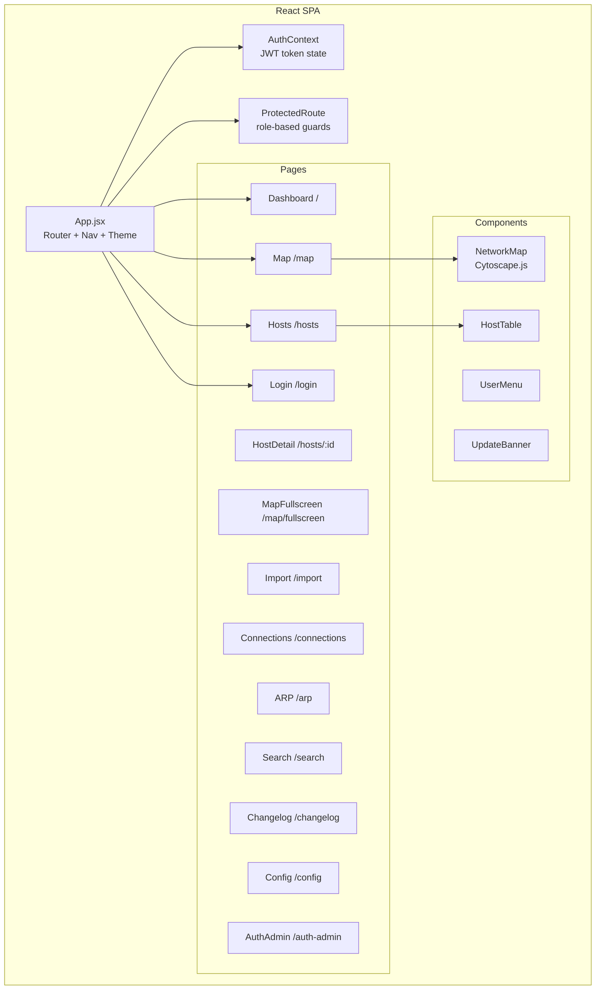

# Frontend

The Grapheon frontend is a Vite + React SPA in `frontend/`. Use the Nix dev shell for any npm command.

## Run Locally

```bash
nix develop -c bash -lc "cd frontend && npm install"
```

```bash
nix develop -c bash -lc "cd frontend && npm run dev"
```

The Vite dev server defaults to `http://localhost:5173` and proxies `/api` to the backend at `http://localhost:8000`.

## Build

```bash
nix develop -c bash -lc "cd frontend && npm run build"
```

## Deployment

The `frontend/Dockerfile` builds the SPA (Node 20-alpine) and serves it via nginx (1.27-alpine) on port 8080. The nginx config (`frontend/nginx.conf`) proxies `/api/` to `http://grapheon-backend:8000` so the SPA can make same-origin API calls.

See `docs/deployment.md` for the full Docker deployment guide.

## App Structure



### Key directories

- `src/api/client.js` — API client with base URL and auth header injection.
- `src/context/AuthContext.jsx` — Authentication state provider (token in localStorage, user profile, role checks).
- `src/components/` — Reusable UI components (NetworkMap, HostTable, ProtectedRoute, UserMenu, UpdateBanner).
- `src/pages/` — Route-level page components.

### Route access control

| Route | Required Role |
|-------|--------------|
| `/login` | Public |
| `/`, `/hosts`, `/map`, `/connections`, `/arp`, `/search`, `/changelog` | Any authenticated user |
| `/import` | `editor` or `admin` |
| `/config`, `/auth-admin` | `admin` |

## Changelog

- Version is sourced from `frontend/package.json`.
- Release notes live in `frontend/CHANGELOG.md`.
- The SPA exposes `/changelog` to render the frontend release notes in-app.
