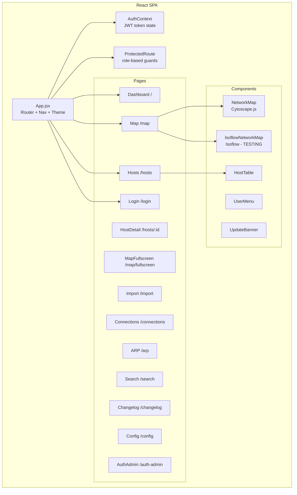

# Frontend

The Graphēon frontend is a Vite + React SPA in `frontend/`. Use the Nix dev shell for any npm command.

## Run Locally

```bash
nix develop -c bash -lc "cd frontend && npm install"
```

```bash
nix develop -c bash -lc "cd frontend && npm run dev"
```

The Vite dev server defaults to `http://localhost:5173` and proxies `/api` to the backend at `http://localhost:8000`.

## Build

```bash
nix develop -c bash -lc "cd frontend && npm run build"
```

## Deployment

The `frontend/Dockerfile` builds the SPA (Node 20-alpine) and serves it via nginx (1.27-alpine) on port 8080. The nginx config (`frontend/nginx.conf`) proxies `/api/` to `http://grapheon-backend:8000` so the SPA can make same-origin API calls.

See `docs/deployment.md` for the full Docker deployment guide.

## App Structure



### Key directories

- `src/api/client.js` — API client with base URL and auth header injection.
- `src/context/AuthContext.jsx` — Authentication state provider (token in localStorage, user profile, role checks).
- `src/components/` — Reusable UI components (NetworkMap, IsoflowNetworkMap, HostTable, ProtectedRoute, UserMenu, UpdateBanner).
- `src/services/isoflowTransformer.js` — Converts Cytoscape elements to isoflow's tile-based format (TESTING).
- `src/pages/` — Route-level page components.

### Route access control

| Route | Required Role |
|-------|--------------|
| `/login` | Public |
| `/`, `/hosts`, `/map`, `/connections`, `/arp`, `/search`, `/changelog` | Any authenticated user |
| `/import` | `editor` or `admin` |
| `/config`, `/auth-admin` | `admin` |

## Isometric View (TESTING)

> **Status: Experimental** — This feature is a test to evaluate whether isometric visualization provides value for network topology diagrams. It may be removed in a future release if it doesn't prove useful.

The Map page offers an alternative **Isometric View** powered by [isoflow](https://github.com/markmanx/isoflow), alongside the primary Cytoscape.js graph view. A toggle button in the toolbar switches between views.

### How it works

1. The same `/api/network/map` endpoint data (Cytoscape elements) is fetched regardless of view mode
2. `isoflowTransformer.js` converts Cytoscape nodes/edges into isoflow's `initialData` format:
   - Host nodes → isoflow items with device-type icons (router, switch, firewall, server, desktop, printer, cube)
   - Compound nodes (VLAN/subnet) → zone rectangles
   - Edges → connectors with color/style based on connection type
   - A grid layout algorithm computes tile positions, grouping hosts by subnet/VLAN
3. `IsoflowNetworkMap` lazy-loads the isoflow library and renders the diagram

### Limitations vs. Graph View

- No automatic graph layout (uses computed grid placement)
- No client-side search/filter (requires re-fetch)
- No compound node nesting (zones are flat rectangles)
- No interactive node selection panel or double-click navigation
- Additional bundle weight (~267 packages including MUI, gsap, zustand)

### Testing

Frontend unit tests for the data transformer are in `src/services/__tests__/isoflowTransformer.test.js` (35 tests covering node extraction, tile layout, connector building, and full pipeline). Run with `npm test`.

## Changelog

- Version is sourced from `frontend/package.json`.
- Release notes live in `frontend/CHANGELOG.md`.
- The SPA exposes `/changelog` to render the frontend release notes in-app.
