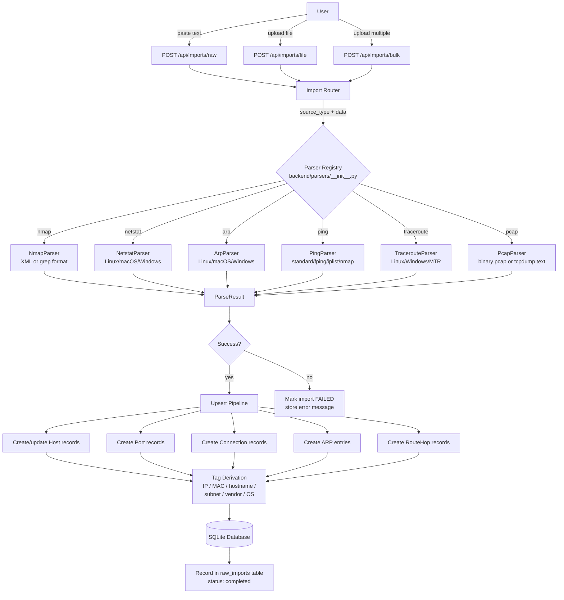
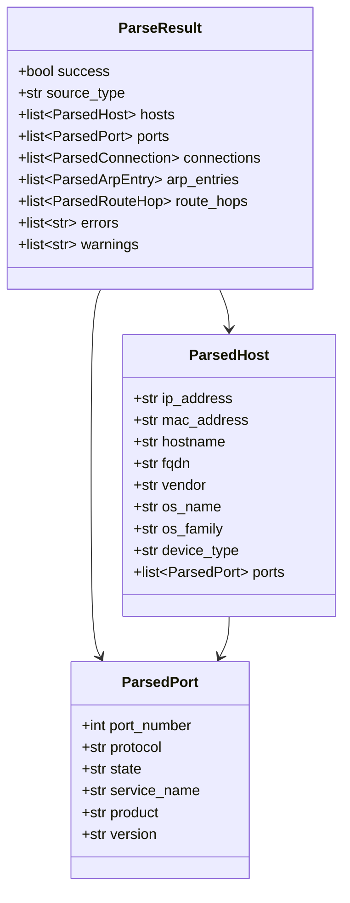

# Graphēon Imports Pipeline

Imports normalize raw network outputs into a consistent schema. Python 3.12 is required for parser execution.

## Import Flow

## Entry Points

- `POST /api/imports/raw` accepts raw text payloads.
- `POST /api/imports/file` accepts file uploads.
- `POST /api/imports/bulk` accepts multiple files at once.

All import routes accept:

- `source_type`: `nmap`, `netstat`, `arp`, `ping`, `traceroute`, or `pcap`.
- `source_host`: IP or hostname of the collector. A host record is created or updated for this value.

## Parsing Flow

1. The import router selects a parser from `backend/parsers/` based on the `source_type` parameter.
2. Each parser auto-detects the input format (e.g., nmap XML vs grep output) via its `detect_format()` method.
3. The parser produces normalized objects: `ParsedHost`, `ParsedPort`, `ParsedConnection`, `ParsedARPEntry`, or `ParsedRouteHop`.
4. The pipeline upserts hosts, ports, connections, and ARP entries into the database.
5. Tags are derived from IPs, MACs, ports, services, and subnets (see `docs/tagging-correlation.md`).
6. The `raw_imports` table records the input, status, and any errors.

## Parser Output Models

## GUID Behavior

Hosts created from imports and raw input receive a GUID that is used as the stable entity identifier. IP or hostname changes do not replace the GUID.

## Errors

If no parser is available or parsing fails, the import record is marked failed and the error message is returned by `/api/imports/{id}`.
