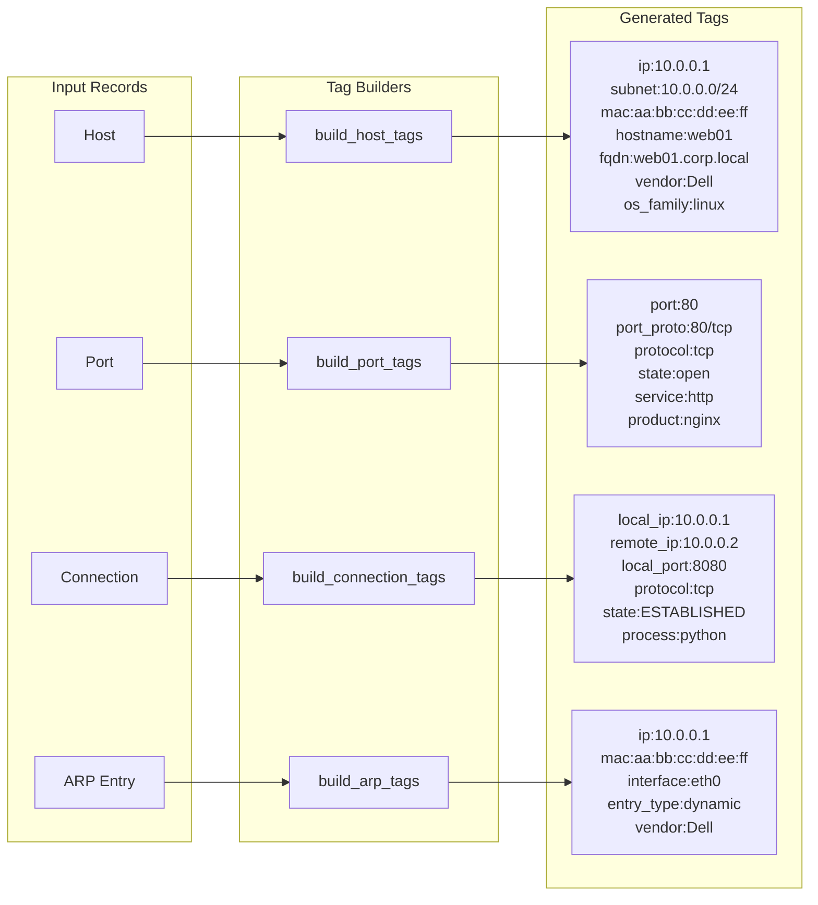
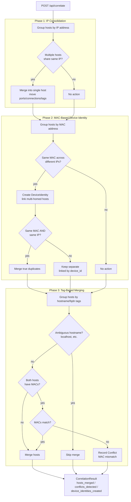

# Graphēon Tagging and Correlation

Tags capture normalized identifiers so data from different sources can be linked. Correlation uses tags plus MAC and IP logic to merge hosts. Python 3.12 is required for the tagging utilities.

## Tag Derivation

Tag builders live in `backend/utils/tagging.py`.

- Host tags include `ip`, `subnet`, `mac`, `hostname`, `fqdn`, `vendor`, `os_family`, and `os`.
- Port tags include `port`, `port_proto`, `protocol`, `state`, `service`, `product`, and `version`.
- Connection tags include local and remote IPs, ports, subnets, protocol, state, and process.
- ARP tags include `ip`, `subnet`, `mac`, `interface`, `entry_type`, and `vendor`.

## Correlation

Correlation runs in `backend/services/correlation.py` and is triggered by `POST /api/correlate`. It runs in three phases:

- **Phase 1** merges hosts that share the same IP.
- **Phase 2** creates or updates `DeviceIdentity` links for same-MAC hosts across different IPs, and only merges true duplicate records (same MAC + same IP).
- **Phase 3** merges hosts that share high-confidence tags like hostname or FQDN.
- MAC conflicts prevent tag-based merges.
- Conflicts are recorded for MAC mismatches and hostname mismatches.

### High-confidence tag prefixes

Only `hostname:` and `fqdn:` tags trigger Phase 3 merges. Ambiguous hostnames (`localhost`, `localhost.localdomain`, `localhost.local`) are excluded from merge consideration.
