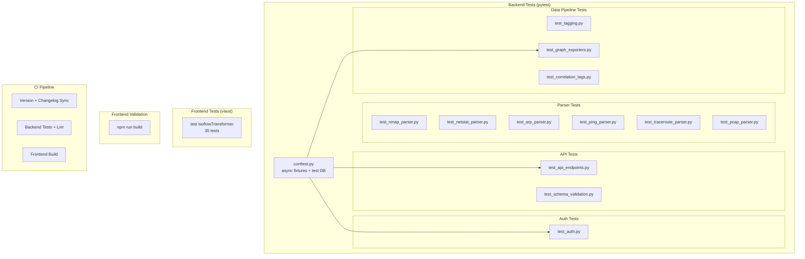
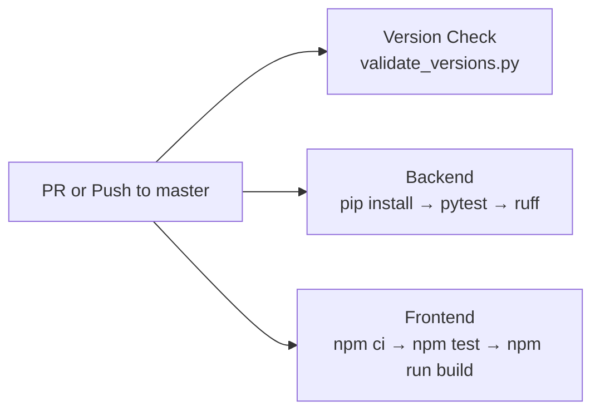

# Testing

Graphēon uses pytest for backend tests. The frontend has no unit test runner configured; it is validated by a successful build (`npm run build`) in CI.

## Quick Reference

```bash
# Run all backend tests
nix develop -c .venv/bin/python -m pytest

# Run with verbose output
nix develop -c .venv/bin/python -m pytest -v

# Run a specific test file
nix develop -c .venv/bin/python -m pytest backend/tests/test_auth.py

# Run a specific test class or function
nix develop -c .venv/bin/python -m pytest backend/tests/test_auth.py::TestJWTService

# Run with coverage
nix develop -c .venv/bin/python -m pytest --cov=backend

# Lint
nix develop -c .venv/bin/ruff check backend

# Frontend build validation
nix develop -c bash -lc "cd frontend && npm run build"
```

## Test Architecture



## Backend Test Files

### conftest.py

Located at `backend/tests/conftest.py`. Provides:

- **Async in-memory SQLite database** for test isolation (each test gets a clean DB).
- **FastAPI test client** via httpx `AsyncClient` with ASGI transport.
- **Dependency override** for `get_db` to use the test database session.

### Parser Tests

| File | Tests | What it covers |
|------|-------|---------------|
| `test_nmap_parser.py` | Format detection, XML parsing, grep parsing, OS inference, IPv6, edge cases | NmapParser with XML (`-oX`) and greppable (`-oG`) formats |
| `test_netstat_parser.py` | Format detection, Linux/macOS/Windows parsing, IPv6, empty input | NetstatParser across platform variants |
| `test_arp_parser.py` | Format detection, multi-platform parsing, MAC normalization | ArpParser for Linux, macOS, Windows output |
| `test_ping_parser.py` | Format detection (iplist/fping/nmap/standard), host extraction | PingParser across output formats |
| `test_traceroute_parser.py` | Format detection (Linux/Windows/MTR), hop parsing, unresponsive hops | TracerouteParser with RTT extraction |
| `test_pcap_parser.py` | Magic byte detection (pcap/pcapng), tcpdump fallback | PcapParser binary and text modes |

### API Tests

| File | Tests | What it covers |
|------|-------|---------------|
| `test_api_endpoints.py` | Health check, host CRUD, import endpoints, network map, request IDs, error formatting | Full API integration with async test client |
| `test_schema_validation.py` | IP/MAC/hostname validation, device type normalization, port ranges, connection states, import size limits | Pydantic schema validation for all request/response models |

### Auth Tests

| File | Tests | What it covers |
|------|-------|---------------|
| `test_auth.py` | JWT creation/verification, login endpoints, RBAC enforcement, role mappings, OIDC service, feature flags, local admin bootstrap, provider CRUD, user management | Complete authentication and authorization system |

This is the largest test file (~1,280 lines) covering:
- JWT token creation and verification (HS256)
- Local login with bcrypt password verification
- Role-based access control (`require_admin`, `require_editor`)
- OIDC callback flow and role resolution from claims
- Feature flag combinations (`AUTH_ENABLED` x `ENFORCE_AUTH`)
- Admin endpoints for provider and mapping management
- User activation/deactivation

### Data Pipeline Tests

| File | Tests | What it covers |
|------|-------|---------------|
| `test_tagging.py` | Host/port/connection/ARP tag generation, tag merging | Tag builder utilities in `backend/utils/tagging.py` |
| `test_correlation_tags.py` | Host grouping by tags, merge validation, ambiguous hostname rejection | Correlation engine merge logic |
| `test_graph_exporters.py` | GraphML XML generation, draw.io mxfile generation, API export endpoints | Export converters and `/api/export/network/{format}` |

## pytest Configuration

From `backend/pytest.ini`:

```ini
[pytest]
asyncio_mode = auto
testpaths = tests
python_files = test_*.py
python_classes = Test*
python_functions = test_*
markers =
    slow: marks tests as slow
    integration: marks tests as requiring database
    e2e: marks tests as end-to-end
filterwarnings = ignore::DeprecationWarning
addopts = -v --tb=short --strict-markers
```

Key points:
- `asyncio_mode = auto` enables automatic async test detection (no need for `@pytest.mark.asyncio`).
- Tests are discovered in `backend/tests/`.
- Strict markers prevent typos in marker names.

## Test Dependencies

From `backend/requirements-dev.txt`:

- **pytest** 8.0.0 -- test runner
- **pytest-asyncio** 0.23.0 -- async test support
- **pytest-cov** 4.1.0 -- coverage reporting
- **pytest-xdist** 3.5.0 -- parallel test execution
- **httpx** -- async HTTP client for API tests
- **factory-boy** 3.3.0 -- test data factories
- **faker** 22.0.0 -- fake data generation
- **ruff** 0.2.0 -- linter
- **mypy** 1.8.0 -- type checker

Install all test dependencies:

```bash
pip install -r backend/requirements.txt -r backend/requirements-dev.txt
```

## Frontend Testing

The frontend uses [Vitest](https://vitest.dev/) for unit tests. Run with:

```bash
cd frontend && npm test        # single run
cd frontend && npm run test:watch  # watch mode
```

### Frontend Test Files

| File | Tests | What it covers |
|------|-------|---------------|
| `src/services/__tests__/isoflowTransformer.test.js` | 35 | Isoflow data transformer: node extraction, tile layout, connectors, rectangles, full pipeline, edge cases |

Frontend validation also includes a successful production build:

```bash
cd frontend && npm run build
```

This catches:
- Import/export errors
- JSX syntax errors
- TypeScript-style errors caught by the build toolchain
- Missing dependencies

## CI Pipeline

The GitHub Actions CI workflow (`.github/workflows/ci.yml`) runs on every PR and push to `master`:



| Job | Steps | Failure means |
|-----|-------|--------------|
| **Version + Changelog Sync** | Run `scripts/validate_versions.py` | Version in `backend/VERSION` or `frontend/package.json` doesn't match changelog |
| **Backend Tests & Lint** | Install deps -> `python -m pytest` -> `ruff check backend` | Test failure or lint violation |
| **Frontend Tests & Build** | `npm ci` -> `npm test` -> `npm run build` | Test failure or build-time error in the React SPA |

## Running Tests Without Nix

If you're not using the Nix dev shell:

```bash
# Create and activate a virtual environment
python3.12 -m venv .venv
source .venv/bin/activate

# Install dependencies
pip install -r backend/requirements.txt -r backend/requirements-dev.txt

# Run tests
python -m pytest

# Lint
ruff check backend
```

## Integration Tests

The file `backend/test_api.py` (root-level) contains integration tests that require a running server. These are gated behind the `RUN_API_TESTS` environment variable:

```bash
# Start the backend first
uvicorn backend.main:app --reload &

# Run integration tests
RUN_API_TESTS=1 python -m pytest backend/test_api.py
```

These tests hit live endpoints and verify end-to-end behavior including imports, host management, and network map generation.
